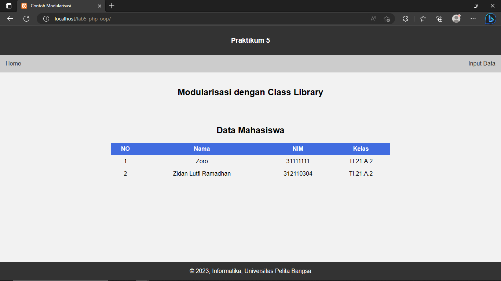
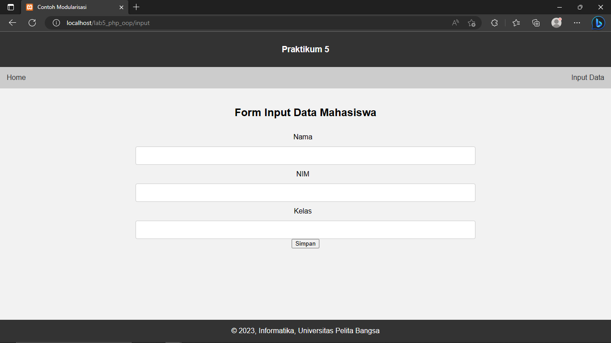
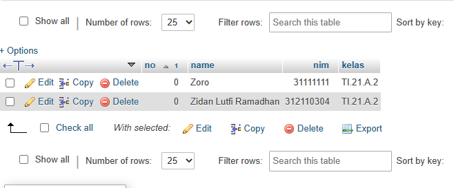

# Tugas Lab5_php_oop

* halaman Home
  
* halaman input 
  
* isi Database
  

* Membuat class library dengan membuat file baru dengan nama form.php.
```php
<?php

class Form
{
    public function input($name, $label)
    {
        return "<div class='form-group'>
                    <label for='$name'>$label</label>
                    <input type='text' class='form-control' name='$name' id='$name'>
                </div>";
    }

    public function submit($label)
    {
        return "<button type='submit' class='btn btn-primary'>$label</button>";
    }
}


```

<br>

* pemanggilan class library form.php. dengan melalui input.php yang juga sebagai tempat untuk meng-input data

```php
<?php
require_once('Database.php');
require_once('Form.php');


// buat instance class Database
$db = new Database('localhost', 'root', '', 'latihan2');

// ambil data dari database
$query = "SELECT * FROM mahasiswa";
$result = $db->query($query);

// buat instance class Form
$form = new Form();


$no = 1;

require_once('header.php')
?>
<html>

<head>
  <title>Modularisasi dengan Class Library</title>
  <link rel="stylesheet" href="style.css">
</head>

<body>
    
    <div class="form">
        <div class="container">
            <h2>Form Input Data Mahasiswa</h2>
                <form method="post" action="save.php">
                    <?php
                    // menampilkan form input nama
                    echo $form->input('name', 'Nama');

                    // menampilkan form input email
                    echo $form->input('nim', 'NIM');

                    // menampilkan form input email
                    echo $form->input('kelas', 'Kelas');

                    // menampilkan tombol submit
                    echo $form->submit('Simpan');
                    ?>
                </form>
        </div>
    </div>
</body>
</html>

<?php require_once('footer.php') ?>
```

<br>

* Membuat file dengan nama database.php untuk database connection dan query.

<br>


```php
<?php

class Database
{
    private $host;
    private $username;
    private $password;
    private $database;
    private $conn;

    public function __construct($host, $username, $password, $database)
    {
        $this->host = $host;
        $this->username = $username;
        $this->password = $password;
        $this->database = $database;

        // membuat koneksi
        $this->conn = new mysqli($this->host, $this->username, $this->password, $this->database);

        // cek apakah koneksi berhasil
        if ($this->conn->connect_error) {
            die("Connection failed: " . $this->conn->connect_error);
        }
    }

    public function query($query)
    {
        // melakukan query ke database
        $result = $this->conn->query($query);

        // cek apakah query berhasil
        if (!$result) {
            die("Query failed: " . $this->conn->error);
        }

        // mengembalikan hasil query dalam bentuk array
        $rows = array();
        while ($row = $result->fetch_assoc()) {
            $rows[] = $row;
        }
        return $rows;
    }

    public function insert($table, $data)
    {
        // memformat data untuk dimasukkan ke database
        $columns = implode(",", array_keys($data));
        $values = implode("','", array_values($data));
        $query = "INSERT INTO $table ($columns) VALUES ('$values')";

        // melakukan query ke database
        $result = $this->conn->query($query);

        // cek apakah query berhasil
        if (!$result) {
            die("Query failed: " . $this->conn->error);
        }
    }

    public function close()
    {
        // menutup koneksi
        $this->conn->close();
    }
}

```

<br>


* Membuat home.php untuk menampilkan data yang telah di input dan sebagai halaman utama


```php
<?php
require_once('Database.php');
require_once('Form.php');


// buat instance class Database
$db = new Database('localhost', 'root', '', 'latihan2');

// ambil data dari database
$query = "SELECT * FROM mahasiswa";
$result = $db->query($query);


$no = 1;

require_once('header.php')
?>

<!DOCTYPE html>
<html>

<head>
    <title>Modularisasi dengan Class Library</title>
    <link rel="stylesheet" href="style.css">
</head>

<body>
    <div class="container">
        <h2>Modularisasi dengan Class Library</h2>
        <br>
        <br>
        <h2>Data Mahasiswa</h2>
        <table class="table">
            <thead>
                <tr>
                    <th>NO</th>
                    <th>Nama</th>
                    <th>NIM</th>
                    <th>Kelas</th>
                </tr>
            </thead>
            <tbody>
                <?php
                // menampilkan data dari database ke dalam tabel
                foreach ($result as $row) {
                    echo "<tr>
                            <td>{$no}</td>
                            <td>{$row['name']}</td>
                            <td>{$row['nim']}</td>
                            <td>{$row['kelas']}</td>
                        </tr>";
                    $no++;
                }
                ?>
            </tbody>
        </table>
    </div>
</body>

</html>

<?php
// menutup koneksi database
$db->close();

require_once('footer.php')
?>
```

<br> 

* dan diberi styling css agar lebih bagus
  
  ``` css
  .container {
    margin: auto;
    max-width: 800px;
    padding: 20px;
    text-align: center;
  }
  
  .table {
    border-collapse: collapse;
    width: 100%;
  }
  
  th, td {
    text-align: center;
    padding: 8px;
  }
  
  tr:nth-child(even){background-color: #f2f2f2}
  
  th {
    background-color: #416ce0;
    color: white;
  }
  
   {
  box-sizing: border-box;
    }

    input[type=text], select, textarea {
    width: 100%;
    padding: 12px;
    border: 1px solid #ccc;
    border-radius: 4px;
    resize: vertical;
    }

    label {
    padding: 12px 12px 12px 0;
    display: inline-block;
    }

    .container {
    border-radius: 5px;
    background-color: #f2f2f2;
    padding: 20px;
    }

    /* Responsive layout - when the screen is less than 600px wide, make the two columns stack on top of each other instead of next to each other */
    @media screen and (max-width: 600px) {
    .col-25, .col-75, input[type=submit] {
        width: 100%;
        margin-top: 0;
    }
    }